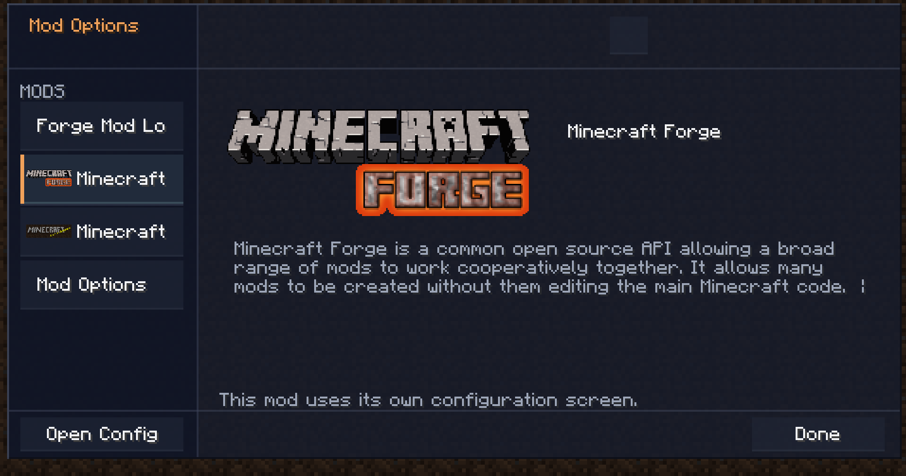

# Mod Options

Shared configuration UI library for Minecraft Forge 1.7.10 mods. Mod Options replaces the standard Forge mod list with a searchable settings browser while preserving access to mods that provide their own native configuration screen.



## Features

- Searchable catalog of installed mods and their settings
- Boolean, integer, double, and enum option controls
- Numeric sliders with configurable ranges and steps
- Ordered, collapsible option groups
- Client, common, and server scope labels
- Automatic grouping for larger ungrouped configurations
- Responsive compact layout with configurable dimensions, colors, and panel opacity
- English and Russian localization
- Fallback access to existing Forge `IModGuiFactory` configuration screens

## Requirements

- Minecraft 1.7.10
- Minecraft Forge 10.13.4.1614
- Java 8

## Build

Clone the repository and run the Gradle wrapper:

```powershell
.\gradlew.bat build
```

On Linux or macOS:

```bash
./gradlew build
```

The built JAR is written to `build/libs/ModOptions-1.7.10-0.0.4.jar`.

For normal play, place that JAR in the instance's `mods` directory. For mod development, add the JAR to your workspace's `libs` directory and declare it as a local dependency:

```groovy
dependencies {
    compile files('libs/ModOptions-1.7.10-0.0.4.jar')
}
```

## Usage

Register options during your mod's initialization. Keep references to the option objects when their change callbacks need to copy values into your configuration and save it.

```java
import com.garden.modoptions.BooleanOption;
import com.garden.modoptions.EnumOption;
import com.garden.modoptions.IntegerOption;
import com.garden.modoptions.ModOptions;
import com.garden.modoptions.OptionScope;

public final class ExampleOptions {
    private static BooleanOption particles;
    private static IntegerOption particleLimit;
    private static EnumOption<Quality> quality;

    public static void register() {
        ModOptions.group("examplemod", "visuals", "Visuals")
                .description("Rendering and particle settings")
                .order(10);

        particles = new BooleanOption(
                "particles", "Enable particles", true,
                OptionScope.CLIENT, ExampleOptions::save);

        particleLimit = new IntegerOption(
                "particleLimit", "Particle limit", 500, 100, 2000, 100,
                OptionScope.CLIENT, ExampleOptions::save);

        quality = new EnumOption<Quality>(
                "quality", "Quality", Quality.values(), 1,
                OptionScope.CLIENT, ExampleOptions::save);

        ModOptions.register("examplemod", "visuals", particles.order(10));
        ModOptions.register("examplemod", "visuals", particleLimit.order(20));
        ModOptions.register("examplemod", "visuals", quality.order(30));
    }

    private static void save() {
        // Copy particles.get(), particleLimit.get(), and quality.get()
        // into your Forge Configuration object, then save it.
    }

    private enum Quality {
        FAST, FANCY, ULTRA
    }

    private ExampleOptions() {}
}
```

Option and group labels may be literal strings or localization keys. Descriptions are shown as contextual help on hover:

```java
particles.description("examplemod.option.particles.description");
```

## Available Options

| Type | Control | Constructor value |
| --- | --- | --- |
| `BooleanOption` | On/off cycle button | `boolean` |
| `IntegerOption` | Stepped slider | `int` with min, max, and step |
| `DoubleOption` | Stepped slider | `double` with min, max, and step |
| `EnumOption<T>` | Value cycle button | Array of values and initial index |

Each option also supports fluent `.group(id)`, `.description(text)`, and `.order(value)` metadata. Lower order values appear first.

## Appearance

Global layout can be adjusted before the screen opens:

```java
ModOptions.setWindowWidth(1040);
ModOptions.setWindowHeight(620);
ModOptions.setCompactLayout(true);
ModOptions.setAutoGrouping(true);
ModOptions.setTransparentPanels(true);
```

Advanced color customization is available through the public fields in `ModOptionsStyle`.
